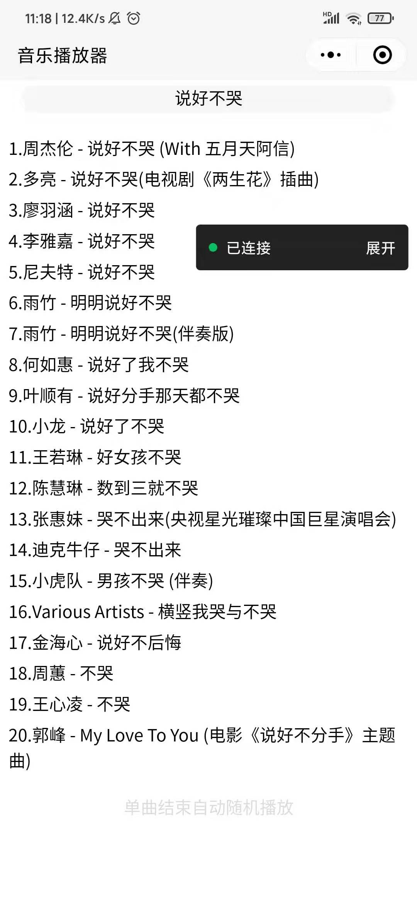

demo：http://118.25.55.180:2951/
-------
>**<label style="color:red">部署到服务器才能运行</label>!**
# chu_music
>【醒目】master分支较乱，包含大量开发代码

>>可以自行切换不同分支查看不同版本

网页音乐播放器，仅1.4K，支持咪咕等等，随心更新中~~

ps：能听歌就行的音乐播放器~
好用的话别忘了star~

## 极简版
simple 分支为最初版，仅1.4K，无任何附加功能
## 简版
simple-last 分支为简版-终板，后面开始加入各种功能
## web component 版本
development/webComponent-0.10分支 

使用web component编写

开发中

PS:属性名不得驼峰式

## 小程序版
mini-program 分支 

因为未过审~~~~

所以直接吧代码拿过来了，有兴趣可以看看

>自用即可，请勿商业用途~
